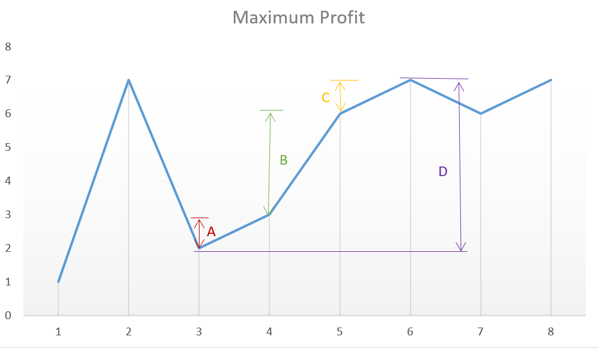

# Simple One Pass

This solution follows the logic used in Approach 2 itself, but with only a slight variation. In this case, instead of looking for every peak following a valley, we can simply go on crawling over the slope and keep on adding the profit obtained from every consecutive transaction. In the end,we will be using the peaks and valleys effectively, but we need not track the costs corresponding to the peaks and valleys along with the maximum profit, but we can directly keep on adding the difference between the consecutive numbers of the array if the second number is larger than the first one, and at the total sum we obtain will be the maximum profit. This approach will simplify the solution. This can be made clearer by taking this example:

`[1, 7, 2, 3, 6, 7, 6, 7]`

The graph corresponding to this array is:

From the above graph, we can observe that the sum A+B+CA+B+C is equal to the difference DD corresponding to the difference between the heights of the consecutive peak and valley.
